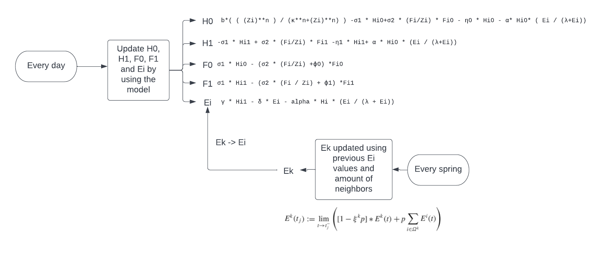

\centering

\raggedright

\clearpage

\tableofcontents

\newpage

# Introduction

Nosemosis is a big problem especially in North America. It is causing a lot of bees to die which is leading to a honeybee crisis in North America, It is even starting to become a problem in Europe now aswell. Nosemosis is a disease caused by two different species of microsporidian parasites, That are a type of fungus that form spores. Whenever a bee becomes infected, it has problems digesting food, which results to a shorter lifespan. Whenever a colony's queen gets infected, they will stop laying eggs. All leading to the whole colony dying [1].

Something what makes the disease especially dangerous is the spreading. One bee could be infected, leading to the whole hive to be infected. Whenever one of those bees is close to another hive, it could infect one of their bees resulting in the whole process happening again and again. Until a whole apiary is infected.

the spread of the infection follows this reproductive cycle.

*SPRING*

- Queen lays more eggs than usual.
- The amount of adult bees increases. 
- Spore transmission as older bees feed younger and young will clean the comb cells contaminated with spores.
- New emerged bees get spores from older bees.
- Nosemosis has a spike when it is spring.

*Summer*

- Queen still lays eggs.
- Young bees continue to arrive become infected.
- The infection rate stays high until mid-summer

*Autumn and winter*

- The queen reduces laying eggs
- N. ceranae spore transmission decreases
- There is a Winter die-back which is not caused by N. ceranae infection
[2]

As mentioned, the spread of Nosemosis is a big problem and needs to be addressed. Which is why there is a mathematical model that follows the spread of Nosemosis [3]. This mathematical model is used to create a simulation that will be used to understand the spread of Nosemosis throughout different hives in an apiary. The simulation could be used by beekeepers that want to keep track of the health of their hives. The goal of this project is to give a visual output of what the spread of Nosemosis looks like. And what the big factors that change the outcome are.

# The model

The model, models the spread of Nosemosis throughout different hives, each day the 5 main values get updated, but every year when spring arrives, the last value (which is the disease level), gets changed according to different values due to hive maintenance in early spring.



## The grid system
Before explaining the formula, it is important to understand how the hives are positioned. This is necessary because the hives interact with eachother. A neighbourhood is a bunch of hives next to eachother on a grid. Each hive has its neighbours. for example: on a 3x3 grid, hive 1 has 3 neighbours (2, 4 and 5), and hive 5 has 8 neighbours (1, 2, 3, 4, 6, 7, 8, 9). This also means that whenever hive 5 is infected, It spreads faster than if hive 1 was infected.

## The equations
The susceptible hive population (Hi0) is calculated within the first equation. The Infected hive population (Hi1) is calculated in the second formula, which uses the environmental disease potential (Ei) to calulate the sub-population. The third and fourth formulas calculate the same as Hi0 and Hi1, Except that it is for the foragers. The last and most important formula calculates the environmental disease potential (Ei). This also gets affected by another formula that only runs every first day of spring. The environmental disease potential for a curtain hive (Ek), is that value (which overwrites the Ei value). Resulting to the Ei value getting overwritten by the Ek value every year.
The Ek formula is a little complicated. At first, it uses The sum of all its neighbous Ek values. Then it calculates the lim of the result of the formula, together with all its previous results. This happens in order to calculate where the Ek value is going to.

The parameters differ each season. The reason for this is that There's different factors every season. The values of all the parameters are shown in the table below. The initial values of the states are 10^4 for Hi0 and Fi0, and 0 for the other three. The reasoning behind the initial values are that there needs to be a population to begin with. Which is 10^4 bees in this case.
The spore deposition rate parameter (y), is different than the other parameters. The values are xyW, meaning it needs to multiply by yw. The article says yw is 0.1. Meaning all the spore deposition rate values will be substituted by 0.1.

```{r echo=FALSE}
library(deSolve)
library(icesTAF)
library(Dict)
```

\newpage
# Results


## Apiary model

The way in which the apiary is set up is quite simple, the hives are placed within a rectangular grid. It is assumed that only neighboring beehives can transmit the pathogen, with an exception of the beehive maintenance in early spring. So in this model a hive in the corner would be able to contaminate its three neighbors and a hive in the middle of the grid would be able to affect eight neighboring hives. We constructed a function called “apiary_creation “ which builds a model of any grid size of n1×n2, stored in a dictionary-like object with the first hive being in the bottom left corner.

## base scenario
Firstly we simulate a scenario in which no pathogen is present, the beehives are thus identical. Fig1 show the state variables, the hive quickly reaches a periodic solution, in which the population peaks at the end of summer and reaches its minimum at the end of winter. Fig2 shows the environmental potential value, the measure of contamination with the pathogen, this stays zero because no nosemosis is introduced. 

```{r error=FALSE, warning=FALSE, echo=FALSE}
parameters.spring <- c(b=500, k=8000, rho1=0.25, rho2=1.5, nn0=0, nn1=0, eps0=0.08511, eps1=0.16936, alpha1=0.55, y=0.2061*0.1 , sumy=0.006570, alphat=0.14, lambda=10000, n=2, p=1)
parameters.summer <- c(b=1500, k=12000, rho1=0.25, rho2=1.5, nn0=0, nn1=0, eps0=0.08511, eps1=0.16936, alpha1=0.12, y=0.2835*0.1 , sumy=0.023300, alphat=0.14, lambda=10000, n=2, p=0)
parameters.fall <- c(b=500, k=8000, rho1=0.25, rho2=1.5, nn0=0, nn1=0, eps0=0.08511, eps1=0.16936, alpha1=0.24, y=0.2527*0.1 , sumy=0.015683, alphat=0.14, lambda=10000, n=2, p=0)
parameters.winter <- c(b=0, k=6000, rho1=0, rho2=1.5, nn0=0.00649, nn1=0.00649, eps0=0, eps1=0, alpha1=0, y=0, sumy=0, alphat=0.14, lambda=10000, n=2, p=0)

formula <- function(t,y,parms){
  with(as.list(c(y,parms)),{
    
          Hi <- Hi0 + Hi1
          Fi <- Fi0 + Fi1
          Zi <- Hi + Fi
    
          dHi0 = b*( ( (Zi)**n ) / (k**n + Zi**n) ) -rho1 * Hi0+rho2 * (Fi/Zi) * Fi0 - nn0 * Hi0 - alpha1* Hi0* ( Ei / (lambda+Ei))

          dHi1 = -rho1 * Hi1 + rho2 * (Fi/Zi) * Fi1 -nn1 * Hi1+ alpha1 * Hi0 * (Ei / (lambda+Ei))

          dFi0 = rho1 * Hi0 - (rho2 * (Fi/Zi) +eps0) *Fi0

          dFi1 = rho1 * Hi1 - (rho2 * (Fi / Zi) + eps1) *Fi1
            
          dEi <- y * Hi1 - sumy * Ei - alphat * Hi * (Ei / (lambda + Ei))

          
          return(list(c(dHi0, dHi1, dFi0, dFi1, dEi)))
       }
       )
}
state = c(Hi0=10**4, Hi1=0, Fi0=10**4, Fi1=0, Ei=0)
times <- seq(0, 364 / 4,  by = 1)

gen_formula <- function(state) {
  out.spring <- as.data.frame(ode(times = times, y = state, parms = parameters.spring, func = formula, method = "euler"))

  state <- c(Hi0=out.spring[nrow(out.spring), 2], Hi1=out.spring[nrow(out.spring), 3], Fi0=out.spring[nrow(out.spring), 4], Fi1=out.spring[nrow(out.spring), 5], Ei=out.spring[nrow(out.spring), 6])
  out.summer <- as.data.frame(ode(times = times, y = state, parms = parameters.summer, func = formula, method = "euler"))

  state <- c(Hi0=out.summer[nrow(out.summer), 2], Hi1=out.summer[nrow(out.summer), 3], Fi0=out.summer[nrow(out.summer), 4], Fi1=out.summer[nrow(out.summer), 5], Ei=out.summer[nrow(out.summer), 6])
  out.fall <- as.data.frame(ode(times = times, y = state, parms = parameters.fall, func = formula, method = "euler"))

  state <- c(Hi0=out.fall[nrow(out.fall), 2], Hi1=out.fall[nrow(out.fall), 3], Fi0=out.fall[nrow(out.fall), 4], Fi1=out.fall[nrow(out.fall), 5], Ei=out.fall[nrow(out.fall), 6])
  out.winter <- as.data.frame(ode(times = times, y = state, parms = parameters.winter, func = formula, method = "euler"))  
  
  out.summer$time <- out.summer$time+ (364/4)
  out.fall$time <- out.fall$time + 2*(364/4)
  out.winter$time <- out.winter$time + 3*(364/4)
  
  out.year <- rbind(out.spring, out.summer, out.fall, out.winter)
  return(list(out.year, out.winter))
}

out.1 <- gen_formula(state)

out.winter <- as.data.frame(out.1[2])
state <- c(Hi0=out.winter[nrow(out.winter), 2], Hi1=out.winter[nrow(out.winter), 3], Fi0=out.winter[nrow(out.winter), 4], Fi1=out.winter[nrow(out.winter), 5], Ei=out.winter[nrow(out.winter), 6])
out.2 <- gen_formula(state)

out.winter <- as.data.frame(out.2[1])
state <- c(Hi0=out.winter[nrow(out.winter), 2], Hi1=out.winter[nrow(out.winter), 3], Fi0=out.winter[nrow(out.winter), 4], Fi1=out.winter[nrow(out.winter), 5], Ei=out.winter[nrow(out.winter), 6])
out.3 <- gen_formula(state)

out.1.frame <- as.data.frame(out.1[1])
out.2.frame <- as.data.frame(out.2[1])
out.3.frame <- as.data.frame(out.3[1])


out.2.frame$time <- out.2.frame$time + 365
out.3.frame$time <- out.3.frame$time + 2*365
out.year <- as.data.frame(rbind(out.1.frame, out.2.frame, out.3.frame))
#out.year$time <- c(1:nrow(out.year))

plot(out.year$time, out.year$Hi0, type="l", ylim=c(0, 35000), xaxt="n", ylab = "Bees", xlab = "Seasons")
lines(out.year$time, out.year$Fi0, lty=2, col=rainbow(1))
lines(out.year$time, out.year$Hi1, lty=3, col=rainbow(2)[2])
lines(out.year$time, out.year$Fi1, lty=4, col=rainbow(3)[3])
axis(1, at=seq(from=1, to=364*3, by = 364 / 4), labels=c("Sp", "S", "F", "W", "Sp", "S", "F", "W", "Sp", "S", "F", "W"))
legend(934, 36400, legend = c("H0", "H1", "F0", "F1"), lty = c(1, 2, 3, 4), title = "Subgroup", xpd="NA", col=rainbow(3))
```
Fig1

```{r error=FALSE, warning=FALSE, echo=FALSE}
plot(out.year$Ei, xaxt="n", type="l", ylab = "Environmental potential", xlab = "Seasons")
axis(1, at=seq(from=1, to=364*3, by = 364 / 4), labels=c("Sp", "S", "F", "W", "Sp", "S", "F", "W", "Sp", "S", "F", "W"))
```
Fig2

## Disease propagation between hives
Two simulations were conducted in order to study the effect of the hives, one in which the first hive infected was hive one, a corner hive. And in the second simulation center hive number 13 was infected. Introducing the pathogen is done by setting Hi1 to ten, the infected hive bee sub-population, to 10 on the first day of the first winter. In all the three seasons before that the state variables were kept at their starting values. For this simulation we assumed the spore uptake (ã) is 14 and a between hive transmission (p) of 1%. For the spore deposition (y) we assumed 0.1 for the first three seasons and 0.0088 for the winter. The simulation 
ran for 30 years.
 
Fig3 describes the environmental potential of the first hive, we observe an unexplainable sudden rise and fall of the Ei where we would theoretically expect a gradual increase of Ei. Zooming in on the graph after the peak in fig4, we see a periodic solution with the maximum value being approximately 400. This suggest that the bee hives do not suffer so much from the fungus that the whole hive collapses, but rather that the disease is season bound. Looking at the same plots but for the 30th hive, we see that that the pathogen reached the hive after about five years. From there it shows the same pattern as the first hive.

```{r error=FALSE, warning=FALSE, echo=FALSE}

n1 <- 6
n2 <- 5

total <- n1*n2
hives <- seq(1,total)

apiary_creation <- function(n1, n2, total, hives){
  hive <- 1
  
  apiary <- Dict$new("temp"=0)
  
  while (hive <= length(hives)){
    #determine the neigbors of the current hive
    neighbors <- c(hive-1, hive+1, hive-n1, hive+n1, hive-n1-1, hive-n1+1, hive+n1-1, hive+n1+1)
    neighbors <- neighbors[neighbors > 0]
    neighbors <- neighbors[neighbors <= total]
    
    #left
    if(hive %% n1 == 1){
      neighbors <- neighbors[neighbors != hive+n1-1]
      neighbors <- neighbors[neighbors != hive-1]
      neighbors <- neighbors[neighbors != hive-n1-1]
    }
    #right
    if(hive %% n1 == 0){
      neighbors <- neighbors[neighbors != hive+1]
      neighbors <- neighbors[neighbors != hive-n1+1]
      neighbors <- neighbors[neighbors != hive+n1+1]
    }
    apiary[as.character(hive)] <- neighbors
    hive <- hive +1
  }
  apiary$remove("temp")
  return(apiary)
}

apiary <- apiary_creation(n1, n2, total, hives)
```

```{r error=FALSE, warning=FALSE, echo=FALSE}
alpha <- 0.15
gamma <- 0.1
p <- 0.01
state = c(Hi0=10**4, Hi1=0, Fi0=10**4, Fi1=0, Ei=0, Ek=0)
Ek <- c(0,0,0,0,0,0,0,0,0,0,0,0,0,0,0,0,0,0,0,0,0,0,0,0,0,0,0,0,0,0)
ev_simulation <- function (p, apiary, Ek, year){
  
  k <- 1
  Ek_updated <-c(0,0,0,0,0,0,0,0,0,0,0,0,0,0,0,0,0,0,0,0,0,0,0,0,0,0,0,0,0,0)
  
  while(k <= apiary$length){
    neighbour.ek <- Ek[apiary$get(k)]
    x <- (1 - length(apiary$get(k)) * p) * Ek[k] + p * sum(neighbour.ek)
    x <- as.numeric(x)
    if (year > 1) {
      prev.dEk <- as.vector(hives.ek[1:year, k])
      EKs <- append(prev.dEk, x)
    } else {
      EKs <- x
    }
    #EKs <- na.omit(EKs)
    EKs<-EKs[!is.na(EKs)]
    
    #dEk <- lim(EKs)[2]
    #dEk <- mean(EKs)
    #dEk <- max(EKs)+5
    #dEk <- quantile(EKs)[5]
    #dEk <- limit(EKs, quantile(Re(EKs),0.99,na.rm=TRUE), lower=quantile(Re(EKs),0.01,na.rm=TRUE))
    dEk <- quantile(Re(EKs),0.99,na.rm=TRUE)
    Ek_updated[k] <- dEk
    
    k <- k+1
  }
  return(Ek_updated)
}
```  

```{r error=FALSE, warning=FALSE, echo=FALSE}
gen_formula_infected <- function(state, first_winter, hive) {
  
  if (first_winter == 1){
    state <- c(Hi0=10**4, Hi1=0, Fi0=10**4, Fi1=0, Ei=0)
  }
  out.spring <- as.data.frame(ode(times = times, y = state, parms = parameters.spring, func = formula, method = "euler"))

  if (first_winter == 1){
    state <- c(Hi0=10**4, Hi1=0, Fi0=10**4, Fi1=0, Ei=0)
  }
  else{
  state <- c(Hi0=out.spring[nrow(out.spring), 2], Hi1=out.spring[nrow(out.spring), 3], Fi0=out.spring[nrow(out.spring), 4], Fi1=out.spring[nrow(out.spring), 5], Ei=out.spring[nrow(out.spring), 6])
  }
  out.summer <- as.data.frame(ode(times = times, y = state, parms = parameters.summer, func = formula, method = "euler"))

    if (first_winter == 1){
    state <- c(Hi0=10**4, Hi1=0, Fi0=10**4, Fi1=0, Ei=0)
  }else{
    
    
  state <- c(Hi0=out.summer[nrow(out.summer), 2], Hi1=out.summer[nrow(out.summer), 3], Fi0=out.summer[nrow(out.summer), 4], Fi1=out.summer[nrow(out.summer), 5], Ei=out.summer[nrow(out.summer), 6])
  }
  
  out.fall <- as.data.frame(ode(times = times, y = state, parms = parameters.fall, func = formula, method = "euler"))
  
   if (first_winter + hive == 2) {
    #state <- c(Hi0=out.fall[nrow(out.fall), 2], Hi1=10, Fi0=out.fall[nrow(out.fall), 4], Fi1=out.fall[nrow(out.fall), 5], Ei=out.fall[nrow(out.fall), 6])
     state <- c(Hi0=10**4, Hi1=10, Fi0=10**4, Fi1=0, Ei=0)
   } else {
    state <- c(Hi0=out.fall[nrow(out.fall), 2], Hi1=out.fall[nrow(out.fall), 3], Fi0=out.fall[nrow(out.fall), 4], Fi1=out.fall[nrow(out.fall), 5], Ei=out.fall[nrow(out.fall), 6])
  }
  # if (first_winter == 1 && hive ==13){
  #      state <- c(Hi0=out.fall[nrow(out.fall), 2], Hi1=10, Fi0=out.fall[nrow(out.fall), 4], Fi1=out.fall[nrow(out.fall), 5], Ei=out.fall[nrow(out.fall), 6])
  #   #state <- c(Hi0=10**4, Hi1=10, Fi0=10**4, Fi1=0, Ei=0)
  # } else {
  #   state <- c(Hi0=out.fall[nrow(out.fall), 2], Hi1=out.fall[nrow(out.fall), 3], Fi0=out.fall[nrow(out.fall), 4], Fi1=out.fall[nrow(out.fall), 5], Ei=out.fall[nrow(out.fall), 6])
  # }
  # 
  
  
  
  out.winter <- as.data.frame(ode(times = times, y = state, parms = parameters.winter, func = formula, method = "euler"))  
  
  out.summer$time <- out.summer$time+ (364/4) 
  out.fall$time <- out.fall$time + 2*(364/4)
  out.winter$time <- out.winter$time + 3*(364/4)
  
  out.year <- rbind(out.spring, out.summer, out.fall, out.winter)
  return(list(out.year, out.winter))
}


hives <- c(1)

parameters.spring <- c(b=500, k=8000, rho1=0.25, rho2=1.5, nn0=0, nn1=0, eps0=0.08511, eps1=0.16936, alpha1=0.55, y=  0.1, sumy=0.006570, alphat=0.14, lambda=10000, n=2, p=1)
parameters.summer <- c(b=1500, k=12000, rho1=0.25, rho2=1.5, nn0=0, nn1=0, eps0=0.08511, eps1=0.16936, alpha1=0.12, y=  0.1, sumy=0.023300, alphat=0.14, lambda=10000, n=2, p=0)
parameters.fall <- c(b=500, k=8000, rho1=0.25, rho2=1.5, nn0=0, nn1=0, eps0=0.08511, eps1=0.16936, alpha1=0.24, y= 0.1, sumy=0.015683, alphat=0.14, lambda=10000, n=2, p=0)
parameters.winter <- c(b=0, k=6000, rho1=0, rho2=1.5, nn0=0.00649, nn1=0.00649, eps0=0, eps1=0, alpha1=0, y=0.0088, sumy=0, alphat=0.14, lambda=10000, n=2, p=0)


#parameters.spring <- c(b=500, k=8000, rho1=0.25, rho2=1.5, nn0=0, nn1=0, eps0=0.08511, eps1=0.16936, alpha1=0.55, y=0.2061*0.1 , sumy=0.006570, alphat=0.14, lambda=10000, n=2, p=1)
#parameters.summer <- c(b=1500, k=12000, rho1=0.25, rho2=1.5, nn0=0, nn1=0, eps0=0.08511, eps1=0.16936, alpha1=0.12, y=0.2835*0.1 , sumy=0.023300, alphat=0.14, lambda=10000, n=2, p=0)
#parameters.fall <- c(b=500, k=8000, rho1=0.25, rho2=1.5, nn0=0, nn1=0, eps0=0.08511, eps1=0.16936, alpha1=0.24, y=0.2527*0.1 , sumy=0.015683, alphat=0.14, lambda=10000, n=2, p=0)
#parameters.winter <- c(b=0, k=6000, rho1=0, rho2=1.5, nn0=0.00649, nn1=0.00649, eps0=0, eps1=0, alpha1=0, y=0, sumy=0, alphat=0.14, lambda=10000, n=2, p=0)
out.years <- data.frame()

index <- 0
winter.state <- c(Hi0=10**4, Hi1=0, Fi0=10**4, Fi1=0, Ei=0)

Ek <- c(0,0,0,0,0,0,0,0,0,0,0,0,0,0,0,0,0,0,0,0,0,0,0,0,0,0,0,0,0,0)

hives.state <- data.frame(matrix(ncol=30, nrow = 30 * 5))
hives.ek <- data.frame(matrix(ncol=30, nrow=30))

hives.ei <- data.frame(matrix(ncol=length(hives)))
names(hives.ei)[1] <- "Ei"

while (index < 30) {
  index <- index + 1
  index2 <- 1 
  while (index2 <= length(Ek)){
    if (index == 1) {
      winter.state <- c(Hi0=10**4, Hi1=0, Fi0=10**4, Fi1=0, Ei=Ek[index2])
    } else {
      winter.state <- c(Hi0=hives.state[(index - 2) * 5 + 1, index2], Hi1=hives.state[(index - 2) * 5 + 2, index2], Fi0=hives.state[(index - 2) * 5 + 3, index2], Fi1=hives.state[(index - 2) * 5 + 4, index2], Ei=hives.ek[index-1,index2])
    }
    
    out.year <- as.data.frame(gen_formula_infected(winter.state, index, index2)[1])
    #if (index2 %in% hives) {
    if (index2 == 1) {
      
      temp.ei <- as.data.frame(out.year$Ei)
      names(temp.ei)[1] <- "Ei"
      hives.ei <- rbind(hives.ei, temp.ei)
    }
    
    
    x <- 1 + ((index - 1) * 5)
    y <- 5 + ((index - 1) * 5)
    hives.state[x:y,index2] <- c(out.year[nrow(out.year), 2], out.year[nrow(out.year), 3], out.year[nrow(out.year), 4], out.year[nrow(out.year), 5], out.year[nrow(out.year), 6])
    
                         
    index2 <- index2 +1
  }
  hives.ek[index,] <- ev_simulation(0.01, apiary, hives.state[(index ) * 5 ,], index)
  

}
b <- nrow(hives.ei)
plot(hives.ei[,1]~seq(1, nrow(hives.ei)), type="l", xaxt="n",ylab = "Environmental potential", xlab = "days", main = "Hive 1" )
```
Fig3

```{r error=FALSE, warning=FALSE, echo=FALSE}
plot(hives.ei[4000:b,1]~seq(4000, nrow(hives.ei)), type="l", xaxt="n",ylab = "Environmental potential", xlab = "days", main = "Hive 1 from day 4000" )
```
Fig4
\newpage
```{r error=FALSE, warning=FALSE, echo=FALSE}
out.years <- data.frame()

index <- 0
winter.state <- c(Hi0=10**4, Hi1=0, Fi0=10**4, Fi1=0, Ei=0)

Ek <- c(0,0,0,0,0,0,0,0,0,0,0,0,0,0,0,0,0,0,0,0,0,0,0,0,0,0,0,0,0,0)

hives.state <- data.frame(matrix(ncol=30, nrow = 30 * 5))
hives.ek <- data.frame(matrix(ncol=30, nrow=30))

hives.ei <- data.frame(matrix(ncol=length(hives)))
names(hives.ei)[1] <- "Ei"

while (index < 30) {
  index <- index + 1
  index2 <- 1 
  while (index2 <= length(Ek)){
    if (index == 1) {
      winter.state <- c(Hi0=10**4, Hi1=0, Fi0=10**4, Fi1=0, Ei=Ek[index2])
    } else {
      winter.state <- c(Hi0=hives.state[(index - 2) * 5 + 1, index2], Hi1=hives.state[(index - 2) * 5 + 2, index2], Fi0=hives.state[(index - 2) * 5 + 3, index2], Fi1=hives.state[(index - 2) * 5 + 4, index2], Ei=hives.ek[index-1,index2])
    }
    
    out.year <- as.data.frame(gen_formula_infected(winter.state, index, index2)[1])
    #if (index2 %in% hives) {
    if (index2 == 30) {
      
      temp.ei <- as.data.frame(out.year$Ei)
      names(temp.ei)[1] <- "Ei"
      hives.ei <- rbind(hives.ei, temp.ei)
    }
    
    
    x <- 1 + ((index - 1) * 5)
    y <- 5 + ((index - 1) * 5)
    hives.state[x:y,index2] <- c(out.year[nrow(out.year), 2], out.year[nrow(out.year), 3], out.year[nrow(out.year), 4], out.year[nrow(out.year), 5], out.year[nrow(out.year), 6])
    
                         
    index2 <- index2 +1
  }
  hives.ek[index,] <- ev_simulation(0.01, apiary, hives.state[(index ) * 5 ,], index)
  

}
b <- nrow(hives.ei)
plot(hives.ei[,1]~seq(1, nrow(hives.ei)), type="l", xaxt="n",ylab = "Environmental potential", xlab = "days", main = "Hive 30" )
```
Fig3

```{r error=FALSE, warning=FALSE, echo=FALSE}
plot(hives.ei[4000:b,1]~seq(4000, nrow(hives.ei)), type="l", xaxt="n",ylab = "Environmental potential", xlab = "days", main = "Hive 30 from day 4000" )
```
Fig4
\newpage

In the second simulation we look at hives number thirteen, the initially infected hive, and its neighbor hive fifteen. We again see the same patterns arise in both hives reaching a maximum value of about 400, but a key distinction being that the fifteenth hive is infected way sooner than was the case in the previous simulation with hive thirty. 


```{r error=FALSE, warning=FALSE, echo=FALSE}
gen_formula_infected <- function(state, first_winter, hive) {
  
  if (first_winter == 1){
    state <- c(Hi0=10**4, Hi1=0, Fi0=10**4, Fi1=0, Ei=0)
  }
  out.spring <- as.data.frame(ode(times = times, y = state, parms = parameters.spring, func = formula, method = "euler"))

  if (first_winter == 1){
    state <- c(Hi0=10**4, Hi1=0, Fi0=10**4, Fi1=0, Ei=0)
  }
  else{
  state <- c(Hi0=out.spring[nrow(out.spring), 2], Hi1=out.spring[nrow(out.spring), 3], Fi0=out.spring[nrow(out.spring), 4], Fi1=out.spring[nrow(out.spring), 5], Ei=out.spring[nrow(out.spring), 6])
  }
  out.summer <- as.data.frame(ode(times = times, y = state, parms = parameters.summer, func = formula, method = "euler"))

    if (first_winter == 1){
    state <- c(Hi0=10**4, Hi1=0, Fi0=10**4, Fi1=0, Ei=0)
  }else{
    
    
  state <- c(Hi0=out.summer[nrow(out.summer), 2], Hi1=out.summer[nrow(out.summer), 3], Fi0=out.summer[nrow(out.summer), 4], Fi1=out.summer[nrow(out.summer), 5], Ei=out.summer[nrow(out.summer), 6])
  }
  
  out.fall <- as.data.frame(ode(times = times, y = state, parms = parameters.fall, func = formula, method = "euler"))
  
  #  if (first_winter + hive == 2) {
  #   state <- c(Hi0=out.fall[nrow(out.fall), 2], Hi1=10, Fi0=out.fall[nrow(out.fall), 4], Fi1=out.fall[nrow(out.fall), 5], Ei=out.fall[nrow(out.fall), 6])
  #    #state <- c(Hi0=10**4, Hi1=10, Fi0=10**4, Fi1=0, Ei=0)
  # } else {
  #   state <- c(Hi0=out.fall[nrow(out.fall), 2], Hi1=out.fall[nrow(out.fall), 3], Fi0=out.fall[nrow(out.fall), 4], Fi1=out.fall[nrow(out.fall), 5], Ei=out.fall[nrow(out.fall), 6])
  #  }
  if (first_winter == 1 && hive ==13){
       state <- c(Hi0=out.fall[nrow(out.fall), 2], Hi1=10, Fi0=out.fall[nrow(out.fall), 4], Fi1=out.fall[nrow(out.fall), 5], Ei=out.fall[nrow(out.fall), 6])
     #state <- c(Hi0=10**4, Hi1=10, Fi0=10**4, Fi1=0, Ei=0)
   } else {
     state <- c(Hi0=out.fall[nrow(out.fall), 2], Hi1=out.fall[nrow(out.fall), 3], Fi0=out.fall[nrow(out.fall), 4], Fi1=out.fall[nrow(out.fall), 5], Ei=out.fall[nrow(out.fall), 6])
   }
   
  
  
  
  out.winter <- as.data.frame(ode(times = times, y = state, parms = parameters.winter, func = formula, method = "euler"))  
  
  out.summer$time <- out.summer$time+ (364/4) 
  out.fall$time <- out.fall$time + 2*(364/4)
  out.winter$time <- out.winter$time + 3*(364/4)
  
  out.year <- rbind(out.spring, out.summer, out.fall, out.winter)
  return(list(out.year, out.winter))
}


hives <- c(1)

parameters.spring <- c(b=500, k=8000, rho1=0.25, rho2=1.5, nn0=0, nn1=0, eps0=0.08511, eps1=0.16936, alpha1=0.55, y=  0.1, sumy=0.006570, alphat=0.14, lambda=10000, n=2, p=1)
parameters.summer <- c(b=1500, k=12000, rho1=0.25, rho2=1.5, nn0=0, nn1=0, eps0=0.08511, eps1=0.16936, alpha1=0.12, y=  0.1, sumy=0.023300, alphat=0.14, lambda=10000, n=2, p=0)
parameters.fall <- c(b=500, k=8000, rho1=0.25, rho2=1.5, nn0=0, nn1=0, eps0=0.08511, eps1=0.16936, alpha1=0.24, y= 0.1, sumy=0.015683, alphat=0.14, lambda=10000, n=2, p=0)
parameters.winter <- c(b=0, k=6000, rho1=0, rho2=1.5, nn0=0.00649, nn1=0.00649, eps0=0, eps1=0, alpha1=0, y=0.0088, sumy=0, alphat=0.14, lambda=10000, n=2, p=0)


#parameters.spring <- c(b=500, k=8000, rho1=0.25, rho2=1.5, nn0=0, nn1=0, eps0=0.08511, eps1=0.16936, alpha1=0.55, y=0.2061*0.1 , sumy=0.006570, alphat=0.14, lambda=10000, n=2, p=1)
#parameters.summer <- c(b=1500, k=12000, rho1=0.25, rho2=1.5, nn0=0, nn1=0, eps0=0.08511, eps1=0.16936, alpha1=0.12, y=0.2835*0.1 , sumy=0.023300, alphat=0.14, lambda=10000, n=2, p=0)
#parameters.fall <- c(b=500, k=8000, rho1=0.25, rho2=1.5, nn0=0, nn1=0, eps0=0.08511, eps1=0.16936, alpha1=0.24, y=0.2527*0.1 , sumy=0.015683, alphat=0.14, lambda=10000, n=2, p=0)
#parameters.winter <- c(b=0, k=6000, rho1=0, rho2=1.5, nn0=0.00649, nn1=0.00649, eps0=0, eps1=0, alpha1=0, y=0, sumy=0, alphat=0.14, lambda=10000, n=2, p=0)
out.years <- data.frame()

index <- 0
winter.state <- c(Hi0=10**4, Hi1=0, Fi0=10**4, Fi1=0, Ei=0)

Ek <- c(0,0,0,0,0,0,0,0,0,0,0,0,0,0,0,0,0,0,0,0,0,0,0,0,0,0,0,0,0,0)

hives.state <- data.frame(matrix(ncol=30, nrow = 30 * 5))
hives.ek <- data.frame(matrix(ncol=30, nrow=30))

hives.ei <- data.frame(matrix(ncol=length(hives)))
names(hives.ei)[1] <- "Ei"

while (index < 30) {
  index <- index + 1
  index2 <- 1 
  while (index2 <= length(Ek)){
    if (index == 1) {
      winter.state <- c(Hi0=10**4, Hi1=0, Fi0=10**4, Fi1=0, Ei=Ek[index2])
    } else {
      winter.state <- c(Hi0=hives.state[(index - 2) * 5 + 1, index2], Hi1=hives.state[(index - 2) * 5 + 2, index2], Fi0=hives.state[(index - 2) * 5 + 3, index2], Fi1=hives.state[(index - 2) * 5 + 4, index2], Ei=hives.ek[index-1,index2])
    }
    
    out.year <- as.data.frame(gen_formula_infected(winter.state, index, index2)[1])
    #if (index2 %in% hives) {
    if (index2 == 13) {
      
      temp.ei <- as.data.frame(out.year$Ei)
      names(temp.ei)[1] <- "Ei"
      hives.ei <- rbind(hives.ei, temp.ei)
    }
    
    
    x <- 1 + ((index - 1) * 5)
    y <- 5 + ((index - 1) * 5)
    hives.state[x:y,index2] <- c(out.year[nrow(out.year), 2], out.year[nrow(out.year), 3], out.year[nrow(out.year), 4], out.year[nrow(out.year), 5], out.year[nrow(out.year), 6])
    
                         
    index2 <- index2 +1
  }
  hives.ek[index,] <- ev_simulation(0.01, apiary, hives.state[(index ) * 5 ,], index)
  

}
b <- nrow(hives.ei)
plot(hives.ei[,1]~seq(1, nrow(hives.ei)), type="l", xaxt="n",ylab = "Environmental potential", xlab = "days", main = "Hive 13" )
```
Fig5


```{r error=FALSE, warning=FALSE, echo=FALSE}
plot(hives.ei[4000:b,1]~seq(4000, nrow(hives.ei)), type="l", xaxt="n",ylab = "Environmental potential", xlab = "days", main = "Hive 13 from day 4000" )
```
Fig6


```{r error=FALSE, warning=FALSE, echo=FALSE}
gen_formula_infected <- function(state, first_winter, hive) {
  
  if (first_winter == 1){
    state <- c(Hi0=10**4, Hi1=0, Fi0=10**4, Fi1=0, Ei=0)
  }
  out.spring <- as.data.frame(ode(times = times, y = state, parms = parameters.spring, func = formula, method = "euler"))

  if (first_winter == 1){
    state <- c(Hi0=10**4, Hi1=0, Fi0=10**4, Fi1=0, Ei=0)
  }
  else{
  state <- c(Hi0=out.spring[nrow(out.spring), 2], Hi1=out.spring[nrow(out.spring), 3], Fi0=out.spring[nrow(out.spring), 4], Fi1=out.spring[nrow(out.spring), 5], Ei=out.spring[nrow(out.spring), 6])
  }
  out.summer <- as.data.frame(ode(times = times, y = state, parms = parameters.summer, func = formula, method = "euler"))

    if (first_winter == 1){
    state <- c(Hi0=10**4, Hi1=0, Fi0=10**4, Fi1=0, Ei=0)
  }else{
    
    
  state <- c(Hi0=out.summer[nrow(out.summer), 2], Hi1=out.summer[nrow(out.summer), 3], Fi0=out.summer[nrow(out.summer), 4], Fi1=out.summer[nrow(out.summer), 5], Ei=out.summer[nrow(out.summer), 6])
  }
  
  out.fall <- as.data.frame(ode(times = times, y = state, parms = parameters.fall, func = formula, method = "euler"))
  
  #  if (first_winter + hive == 2) {
  #   state <- c(Hi0=out.fall[nrow(out.fall), 2], Hi1=10, Fi0=out.fall[nrow(out.fall), 4], Fi1=out.fall[nrow(out.fall), 5], Ei=out.fall[nrow(out.fall), 6])
  #    #state <- c(Hi0=10**4, Hi1=10, Fi0=10**4, Fi1=0, Ei=0)
  # } else {
  #   state <- c(Hi0=out.fall[nrow(out.fall), 2], Hi1=out.fall[nrow(out.fall), 3], Fi0=out.fall[nrow(out.fall), 4], Fi1=out.fall[nrow(out.fall), 5], Ei=out.fall[nrow(out.fall), 6])
  #  }
  if (first_winter == 1 && hive ==13){
       state <- c(Hi0=out.fall[nrow(out.fall), 2], Hi1=10, Fi0=out.fall[nrow(out.fall), 4], Fi1=out.fall[nrow(out.fall), 5], Ei=out.fall[nrow(out.fall), 6])
     #state <- c(Hi0=10**4, Hi1=10, Fi0=10**4, Fi1=0, Ei=0)
   } else {
     state <- c(Hi0=out.fall[nrow(out.fall), 2], Hi1=out.fall[nrow(out.fall), 3], Fi0=out.fall[nrow(out.fall), 4], Fi1=out.fall[nrow(out.fall), 5], Ei=out.fall[nrow(out.fall), 6])
   }
   
  
  
  
  out.winter <- as.data.frame(ode(times = times, y = state, parms = parameters.winter, func = formula, method = "euler"))  
  
  out.summer$time <- out.summer$time+ (364/4) 
  out.fall$time <- out.fall$time + 2*(364/4)
  out.winter$time <- out.winter$time + 3*(364/4)
  
  out.year <- rbind(out.spring, out.summer, out.fall, out.winter)
  return(list(out.year, out.winter))
}


hives <- c(1)

parameters.spring <- c(b=500, k=8000, rho1=0.25, rho2=1.5, nn0=0, nn1=0, eps0=0.08511, eps1=0.16936, alpha1=0.55, y=  0.1, sumy=0.006570, alphat=0.14, lambda=10000, n=2, p=1)
parameters.summer <- c(b=1500, k=12000, rho1=0.25, rho2=1.5, nn0=0, nn1=0, eps0=0.08511, eps1=0.16936, alpha1=0.12, y=  0.1, sumy=0.023300, alphat=0.14, lambda=10000, n=2, p=0)
parameters.fall <- c(b=500, k=8000, rho1=0.25, rho2=1.5, nn0=0, nn1=0, eps0=0.08511, eps1=0.16936, alpha1=0.24, y= 0.1, sumy=0.015683, alphat=0.14, lambda=10000, n=2, p=0)
parameters.winter <- c(b=0, k=6000, rho1=0, rho2=1.5, nn0=0.00649, nn1=0.00649, eps0=0, eps1=0, alpha1=0, y=0.0088, sumy=0, alphat=0.14, lambda=10000, n=2, p=0)


#parameters.spring <- c(b=500, k=8000, rho1=0.25, rho2=1.5, nn0=0, nn1=0, eps0=0.08511, eps1=0.16936, alpha1=0.55, y=0.2061*0.1 , sumy=0.006570, alphat=0.14, lambda=10000, n=2, p=1)
#parameters.summer <- c(b=1500, k=12000, rho1=0.25, rho2=1.5, nn0=0, nn1=0, eps0=0.08511, eps1=0.16936, alpha1=0.12, y=0.2835*0.1 , sumy=0.023300, alphat=0.14, lambda=10000, n=2, p=0)
#parameters.fall <- c(b=500, k=8000, rho1=0.25, rho2=1.5, nn0=0, nn1=0, eps0=0.08511, eps1=0.16936, alpha1=0.24, y=0.2527*0.1 , sumy=0.015683, alphat=0.14, lambda=10000, n=2, p=0)
#parameters.winter <- c(b=0, k=6000, rho1=0, rho2=1.5, nn0=0.00649, nn1=0.00649, eps0=0, eps1=0, alpha1=0, y=0, sumy=0, alphat=0.14, lambda=10000, n=2, p=0)
out.years <- data.frame()

index <- 0
winter.state <- c(Hi0=10**4, Hi1=0, Fi0=10**4, Fi1=0, Ei=0)

Ek <- c(0,0,0,0,0,0,0,0,0,0,0,0,0,0,0,0,0,0,0,0,0,0,0,0,0,0,0,0,0,0)

hives.state <- data.frame(matrix(ncol=30, nrow = 30 * 5))
hives.ek <- data.frame(matrix(ncol=30, nrow=30))

hives.ei <- data.frame(matrix(ncol=length(hives)))
names(hives.ei)[1] <- "Ei"

while (index < 30) {
  index <- index + 1
  index2 <- 1 
  while (index2 <= length(Ek)){
    if (index == 1) {
      winter.state <- c(Hi0=10**4, Hi1=0, Fi0=10**4, Fi1=0, Ei=Ek[index2])
    } else {
      winter.state <- c(Hi0=hives.state[(index - 2) * 5 + 1, index2], Hi1=hives.state[(index - 2) * 5 + 2, index2], Fi0=hives.state[(index - 2) * 5 + 3, index2], Fi1=hives.state[(index - 2) * 5 + 4, index2], Ei=hives.ek[index-1,index2])
    }
    
    out.year <- as.data.frame(gen_formula_infected(winter.state, index, index2)[1])
    #if (index2 %in% hives) {
    if (index2 == 15) {
      
      temp.ei <- as.data.frame(out.year$Ei)
      names(temp.ei)[1] <- "Ei"
      hives.ei <- rbind(hives.ei, temp.ei)
    }
    
    
    x <- 1 + ((index - 1) * 5)
    y <- 5 + ((index - 1) * 5)
    hives.state[x:y,index2] <- c(out.year[nrow(out.year), 2], out.year[nrow(out.year), 3], out.year[nrow(out.year), 4], out.year[nrow(out.year), 5], out.year[nrow(out.year), 6])
    
                         
    index2 <- index2 +1
  }
  hives.ek[index,] <- ev_simulation(0.01, apiary, hives.state[(index ) * 5 ,], index)
  

}
b <- nrow(hives.ei)
plot(hives.ei[,1]~seq(1, nrow(hives.ei)), type="l", xaxt="n",ylab = "Environmental potential", xlab = "days", main = "Hive 15" )
```
Fig5


```{r error=FALSE, warning=FALSE, echo=FALSE}
plot(hives.ei[4000:b,1]~seq(4000, nrow(hives.ei)), type="l", xaxt="n",ylab = "Environmental potential", xlab = "days", main = "Hive 15 from day 4000" )
```
Fig6
\newpage

# conclusion
Looking at the way the simulations come to a periodic solution in which the pathogen arises in the spring and nearly disappears in the winter, this suggests that the infestation does not trigger the hives to fail completely but they just get weaker. Much like the flu does in the human population.

The second conclusion we can draw from the model is that the propagation of the fungus when a center hive is infected versus when a corner or a hive at the edge is infected is significantly faster. This can be validated by the fact that only neighboring hives infect each other, so a hive in the middle having five more neighbors than a corner hive has a more than two fold range causing the pathogen to expand more rampant across the apiary.

The final conclusion the model comes to is that having neighboring hives also infected with the pathogen does not cause a higher plateau value in the eventual periodic solution. This tells us that there are no long term effects of which hive was infected first, the hives all go through the same pattern when infected, this can also be said for the size of an apiary.


# discussion
The main critique on the original paper from our side is the limit function in the formula calculating Ek. It is very unclear how this function should be implemented in the differential equation solver. We would have loved to contact the authors of the paper about this, but due to time constraints this was not an option anymore. We in turn found a work around that was satisfyïng enough using a max value with a moderate cutoff. 

The main assumption that the model holds is that the infection of neighboring hives only occurs once a year with direct neighbors. It seems weird that the hives would only contaminate other hives during hive maintenance, and then only their neighboring hives. Because when performing hive maintenance, the action of the beekeeper cleaning and emptying the hives, the actual physical location of the hive would not have an impact on contamination but rather the order in which hives are maintained. Also there is no scenario in which bees infect other hives on their own, not a far-fetched idea.

There is also a critique to be had on our implementation of the model, mainly the unexplainable sudden rise and fall of the Ei value in our plots. This is most certainly due to a programmatic error on our side. Also because of time constraints there is no possibility for us to assess this problem, but we presume the rest of the model is correctly implemented because it shows similar results as the original paper.

\newpage

# rcode

## Base model
The implementation of the base model in the desolve ode function, characters had to be changes in order for R studio to handle them.

```{r eval=FALSE, tidy=TRUE}
formula <- function(t,y,parms){
  with(as.list(c(y,parms)),{
    
          Hi <- Hi0 + Hi1
          Fi <- Fi0 + Fi1
          Zi <- Hi + Fi
    
          dHi0 = b*( ( (Zi)**n ) / (k**n + Zi**n) ) -rho1 * Hi0+rho2 * (Fi/Zi) * Fi0 - nn0 * Hi0 - alpha1* Hi0* ( Ei / (lambda+Ei))

          dHi1 = -rho1 * Hi1 + rho2 * (Fi/Zi) * Fi1 -nn1 * Hi1+ alpha1 * Hi0 * (Ei / (lambda+Ei))

          dFi0 = rho1 * Hi0 - (rho2 * (Fi/Zi) +eps0) *Fi0

          dFi1 = rho1 * Hi1 - (rho2 * (Fi / Zi) + eps1) *Fi1
            
          dEi <- y * Hi1 - sumy * Ei - alphat * Hi * (Ei / (lambda + Ei))

          return(list(c(dHi0, dHi1, dFi0, dFi1, dEi)))
       }
       )
}
```

## Apiary setup
This function creates the grid in which the neigtbors of each hive are determined.

```{r eval=FALSE, tidy=TRUE}
n1 <- 6 #length dimension of apiary grid
n2 <- 5 #width dimension of apiary grid

total <- n1*n2 #total number of hives
hives <- seq(1,total) #create a sequence of the totaal amount of hives

apiary_creation <- function(n1, n2, total, hives){
  hive <- 1
  #initiate new dictionairy object
  apiary <- Dict$new("temp"=0) 
  
  while (hive <= length(hives)){
    #determine the neigbors of the current hive
    neighbors <- c(hive-1, hive+1, hive-n1, hive+n1, hive-n1-1, hive-n1+1, hive+n1-1, hive+n1+1)
    neighbors <- neighbors[neighbors > 0]
    neighbors <- neighbors[neighbors <= total]
    
    #remove when when hive is on the left edge
    if(hive %% n1 == 1){
      neighbors <- neighbors[neighbors != hive+n1-1]
      neighbors <- neighbors[neighbors != hive-1]
      neighbors <- neighbors[neighbors != hive-n1-1]
    }
    #remove when when hive is on the right edge
    if(hive %% n1 == 0){
      neighbors <- neighbors[neighbors != hive+1]
      neighbors <- neighbors[neighbors != hive-n1+1]
      neighbors <- neighbors[neighbors != hive+n1+1]
    }
    apiary[as.character(hive)] <- neighbors
    hive <- hive +1
  }
  apiary$remove("temp")
  return(apiary)
}
#store the dictionairy in the apiary object
apiary <- apiary_creation(n1, n2, total, hives)
```

## Yearly hive maintenance
Implementation of the formula describing the yearly hive maintenance.

```{r eval=FALSE, tidy=TRUE}
p <- 0.01 #The p parameter value

ev_simulation <- function (p, apiary, Ek, year){
  k <- 1
  #New vector to hold all the generated Ek values
  Ek_updated <-c(0,0,0,0,0,0,0,0,0,0,0,0,0,0,0,0,0,0,0,0,0,0,0,0,0,0,0,0,0,0)
  
  while(k <= apiary$length){
    neighbour.ek <- Ek[apiary$get(k)] #get the neigbors of the k'th hive
    x <- (1 - length(apiary$get(k)) * p) * Ek[k] + p * sum(neighbour.ek) #run the formula
    x <- as.numeric(x)#convert string to number
    if (year > 1) {
      #When already run, retake the previous from the hives.ek dataframe
      prev.dEk <- as.vector(hives.ek[1:year, k])
      EKs <- append(prev.dEk, x)
    } else {
      EKs <- x
    }
    EKs<-EKs[!is.na(EKs)] #remove NAs
    dEk <- quantile(Re(EKs),0.99,na.rm=TRUE) #alternative implementation of lim function
    Ek_updated[k] <- dEk #Put the new Ek value in the updated vector
    
    k <- k+1
  }
  return(Ek_updated)
}
```  

## general formula running the base model for a year
This function runs the base model for a year with differing parameters. We made two versions of this function, this one was used to simulate the infection of hive one.
The function in which hive thirteen was infected differs slightly.

```{r eval=FALSE, tidy=TRUE}
gen_formula_infected <- function(state, first_winter, hive) {
  
  if (first_winter == 1){
    #in the first three seasons we want to use the base states
    state <- c(Hi0=10**4, Hi1=0, Fi0=10**4, Fi1=0, Ei=0)
  }
  #run the simulation for the spring
  out.spring <- as.data.frame(ode(times = times, y = state, parms = parameters.spring, func = formula, method = "euler"))

  if (first_winter == 1){
    state <- c(Hi0=10**4, Hi1=0, Fi0=10**4, Fi1=0, Ei=0)
  }
  else{
  state <- c(Hi0=out.spring[nrow(out.spring), 2], Hi1=out.spring[nrow(out.spring), 3], Fi0=out.spring[nrow(out.spring), 4], Fi1=out.spring[nrow(out.spring), 5], Ei=out.spring[nrow(out.spring), 6])
  }
  #run the simulation for the summer
  out.summer <- as.data.frame(ode(times = times, y = state, parms = parameters.summer, func = formula, method = "euler"))

    if (first_winter == 1){
    state <- c(Hi0=10**4, Hi1=0, Fi0=10**4, Fi1=0, Ei=0)
  }else{
    
  state <- c(Hi0=out.summer[nrow(out.summer), 2], Hi1=out.summer[nrow(out.summer), 3], Fi0=out.summer[nrow(out.summer), 4], Fi1=out.summer[nrow(out.summer), 5], Ei=out.summer[nrow(out.summer), 6])
  }
  #run the simulation for the fall
  out.fall <- as.data.frame(ode(times = times, y = state, parms = parameters.fall, func = formula, method = "euler"))
  
   if (first_winter + hive == 2) {

     state <- c(Hi0=10**4, Hi1=10, Fi0=10**4, Fi1=0, Ei=0)
   } else {
    state <- c(Hi0=out.fall[nrow(out.fall), 2], Hi1=out.fall[nrow(out.fall), 3], Fi0=out.fall[nrow(out.fall), 4], Fi1=out.fall[nrow(out.fall), 5], Ei=out.fall[nrow(out.fall), 6])
  }
  #run the simulation for the winter
  out.winter <- as.data.frame(ode(times = times, y = state, parms = parameters.winter, func = formula, method = "euler"))  
  
  #add a column with time
  out.summer$time <- out.summer$time+ (364/4) 
  out.fall$time <- out.fall$time + 2*(364/4)
  out.winter$time <- out.winter$time + 3*(364/4)
  
  out.year <- rbind(out.spring, out.summer, out.fall, out.winter) #combine all the results of the seasons and return
  return(list(out.year, out.winter))
}
````

## Running the simulation
Here we also have multiple versions, in this one the Ei values for the first hive are stored for plotting.

```{r eval=FALSE, tidy=TRUE}
#first initialize the parameters for ech season
parameters.spring <- c(b=500, k=8000, rho1=0.25, rho2=1.5, nn0=0, nn1=0, eps0=0.08511, eps1=0.16936, alpha1=0.55, y=  0.1, sumy=0.006570, alphat=0.14, lambda=10000, n=2, p=1)
parameters.summer <- c(b=1500, k=12000, rho1=0.25, rho2=1.5, nn0=0, nn1=0, eps0=0.08511, eps1=0.16936, alpha1=0.12, y=  0.1, sumy=0.023300, alphat=0.14, lambda=10000, n=2, p=0)
parameters.fall <- c(b=500, k=8000, rho1=0.25, rho2=1.5, nn0=0, nn1=0, eps0=0.08511, eps1=0.16936, alpha1=0.24, y= 0.1, sumy=0.015683, alphat=0.14, lambda=10000, n=2, p=0)
parameters.winter <- c(b=0, k=6000, rho1=0, rho2=1.5, nn0=0.00649, nn1=0.00649, eps0=0, eps1=0, alpha1=0, y=0.0088, sumy=0, alphat=0.14, lambda=10000, n=2, p=0)

out.years <- data.frame()#create the out.years dataframe

index <- 0

Ek <- c(0,0,0,0,0,0,0,0,0,0,0,0,0,0,0,0,0,0,0,0,0,0,0,0,0,0,0,0,0,0)#initial values for Ek

#create multiple dataframes for storage of the data, named accordingly
hives.state <- data.frame(matrix(ncol=30, nrow = 30 * 5))
hives.ek <- data.frame(matrix(ncol=30, nrow=30))
hives.ei <- data.frame(matrix(ncol=length(hives)))
names(hives.ei)[1] <- "Ei"

#loop for thirty years
while (year < 30) {
  #update vavlues
  year <- year + 1
  hive <- 1 
  #loop for all the hives
  while (hive <= length(Ek)){
    #for the first year define the state
    if (year == 1) {
      winter.state <- c(Hi0=10**4, Hi1=0, Fi0=10**4, Fi1=0, Ei=Ek[hive])
    } else {
      #if not the first year, fetch the last used state
      winter.state <- c(Hi0=hives.state[(year - 2) * 5 + 1, hive], Hi1=hives.state[(year - 2) * 5 + 2, hive], Fi0=hives.state[(year - 2) * 5 + 3, hive], Fi1=hives.state[(year - 2) * 5 + 4, hive], Ei=hives.ek[year-1,hive])
    }
    #Run the base model and store the wanted data in a datframe
    out.year <- as.data.frame(gen_formula_infected(winter.state, year, hive)[1])
    
    #if discussing the first hive, hold the Ei values for plotting
    if (hive == 1) {
      temp.ei <- as.data.frame(out.year$Ei)
      names(temp.ei)[1] <- "Ei"
      hives.ei <- rbind(hives.ei, temp.ei)
    }
    
    #Fetch the data from out.year to create a new state for the ode solver
    x <- 1 + ((year - 1) * 5)
    y <- 5 + ((year - 1) * 5)
    hives.state[x:y,hive] <- c(out.year[nrow(out.year), 2], out.year[nrow(out.year), 3], out.year[nrow(out.year), 4], out.year[nrow(out.year), 5], out.year[nrow(out.year), 6])
    
    hive <- hive +1
  }
  #at the end of the year, run the yearly hive maintenance and store the values appropriately
  hives.ek[year,] <- ev_simulation(0.01, apiary, hives.state[(year ) * 5 ,], year)
}
```
\newpage

# References
https://beeaware.org.au/archive-pest/nosema/#ad-image-0 [1]
https://www.sciencedirect.com/topics/medicine-and-dentistry/nosemosis#:~:text=Nosemosis%20symptoms%20include%20lifespan%20reduction%2C%20lethargic%20behavior%2C%20and,N.%20ceranae%20in%20both%20laboratory%20and%20field%20trials. [2]
https://link.springer.com/chapter/10.1007/978-3-319-99719-3_35 [3]
