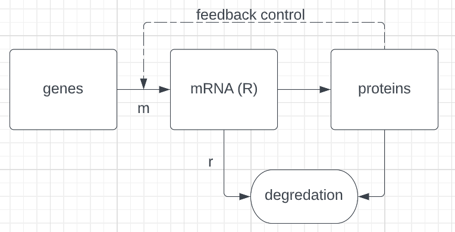

##1
[1]
De parameters die je moet programeren zijn r en m, deze zijn constant.
En ook R, dit is een initiële waarde en veranderd dus over de tijd.


[2]
Chen99.pdf


[3]
Het biologisch model met de bijbehorende parameers aangegeven.




[4]

De standaard output is een dataframe met al de inzichten van de analyse op het model.
R word niet simpelweg teruggegeven want deze hoeft niet constant te zijn.


##2

```{r}
library(deSolve)

parameters.steady <- c( r = 0.1, m = 10 )
parameters.increase <- c( r = 0.1, m = 15 )
parameters.decrease <- c( r = 0.1, m = 5 )

mrna_degradation <- function(t,y,parms){
  with(as.list(c(parms)),{
         dY <- -r*y + m
         return(list(c(dY)))
       }
       )
}

state = c(R=100)
times <- seq(0, 100,  by = 1)

out.steady  <- ode(times = times, y = state,   parms = parameters.steady, func = mrna_degradation , method = "euler")
out.increase  <- ode(times = times, y = state,   parms = parameters.increase, func = mrna_degradation , method = "euler")
out.decrease  <- ode(times = times, y = state,   parms = parameters.decrease, func = mrna_degradation , method = "euler")

plot(out.steady,out.increase,out.decrease)
```


