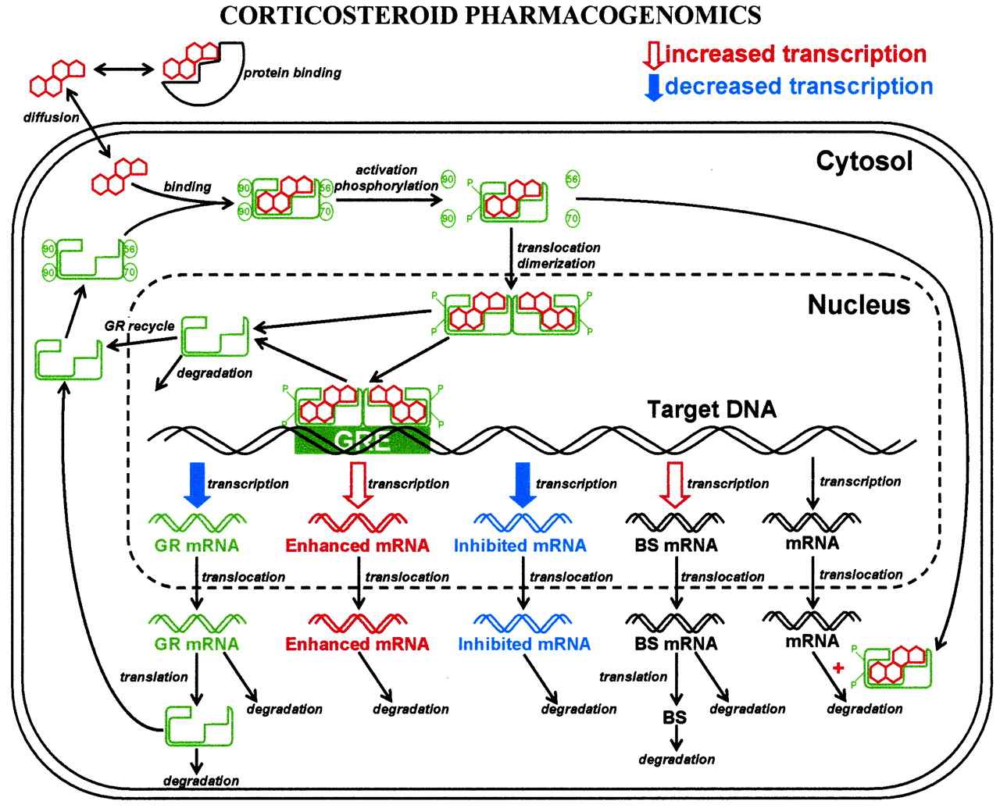

---
output:
  pdf_document: default
  html_document: default
---

```{r echo=FALSE}
library(deSolve)
library(rootSolve)

parameters.1 <- c(ks_Rm = 2.90, IC50_Rm = 26.2, kd_Rm = 0.612, ks_r = 3.22, Rf = 0.49, kre = 0.57, kon = 0.00329, kd_R = 0.0572, kT = 0.63, D = 14.59 )
parameters.3 <- c(ks_Rm = 2.90, IC50_Rm = 26.2, kd_Rm = 0.612, ks_r = 3.22, Rf = 0.49, kre = 0.57, kon = 0.00329, kd_R = 0.0572, kT = 0.63, D = 39.925 )

formula_1 <- function(t,y,parms){
  with(as.list(c(y,parms)),{
         D <- D * 1000 * (1 / 374.471)
         dmRNAr <- ks_Rm * (1 - DRN/(IC50_Rm+DRN)) - kd_Rm * mRNAr
         dR <- ks_r * mRNAr + Rf *kre *DRN - kon * D * R - kd_R * R
         dDR <- kon * D * R - kT *DR
         dDRN <- kT * DR - kre * DRN
         return(list(c(dmRNAr ,dR ,dDR, dDRN)))
       }
       )
}
state = c(mRNAr = 4.74, R = 267 ,DR = 0, DRN = 0)
times <- seq(0, 168,  by = 1)
out.1  <- ode(times = times, y = state, parms = parameters.1, func = formula_1, method = "euler")
out.3  <- ode(times = times, y = state, parms = parameters.3, func = formula_1, method = "euler")
```

# Model Expression glucorticoid repectors



- Keimpe Dijkstra
- Wouter Zeevat

\newpage

\tableofcontents

\newpage

## Introduction

\newpage

## Materials & Methods

\newpage

## Results

```{r echo=FALSE, warning=FALSE}
#read data
data <- read.csv("MPL.csv", na.strings = "NA")
median_MPL_01 <- median(data$MPL_conc[data$dose==0.1], na.rm=T)
medians <- aggregate(data[,c("MPL_conc","mRNA","Free_receptor")],list(data$dose,data$time), median, na.rm=T)
names(medians)[1:2] <- c("dose","time")

#prepare data for plotting
m.d.3 <- subset(medians, dose == 0.3)
m.d.1 <- subset(medians, dose == 0.1)
d.3 <- subset(data, dose == 0.3)
d.1 <- subset(data, dose == 0.1)
out.1 <- as.data.frame(out.1)
out.3 <- as.data.frame(out.3)

par(mfrow=c(2,2))
#plots for 0.3 dose
plot( m.d.3$time, m.d.3$mRNA,type = "l", col = "red", ylab="Receptor mRNA", xlab="Time")
lines(out.3$time, out.3$mRNAr)
points(d.3$time, d.3$mRNA, pch="*")
plot(m.d.3$time, m.d.3$Free_receptor, type = "l", col = "red", ylab="Receptor density", xlab="Time")
lines(out.3$time, out.3$R)
points(d.3$time, d.3$Free_receptor, pch="*")

#plots for 0.1 dose
plot( m.d.1$time, m.d.1$mRNA,type = "l", col = "red", ylab="Receptor complex concentration", xlab="Time")
lines(out.1$time, out.1$mRNAr)
points(d.1$time, d.1$mRNA, pch="*")
plot(m.d.1$time, m.d.1$Free_receptor, type = "l", col = "red", ylab="Activated complex concentration", xlab="Time")
lines(out.1$time, out.1$R)
points(d.1$time, d.1$Free_receptor, pch="*")

legend(100,300, legend = c("median data", "Model", "Data"), lty = c(1, 1, 3), title = "Subgroup", xpd="NA", col=c("red", "black", "black"))
mtext("Model VS actual data", side = 3, line = -1, outer = TRUE)
```
The results of the model are not in line with the data. An explanation for this could be that the glucose level in someone's body is constantly changing. Which could result in the lines shaking due to the glucose levels that are shaking too.

```{r echo=FALSE, warning=FALSE}
formula_2 <- function(t,y,parms){
  with(as.list(c(y,parms)),{
         D <- D * 1000 * (1 / 374.471)
         dmRNAr <- ks_Rm * (1 - DRN/(IC50_Rm+DRN)) - kd_Rm * mRNAr
         dR <- ks_r * mRNAr + Rf *kre *DRN - kon  * R - kd_R * R
         dDR <- kon  * R - kT *DR
         dDRN <- kT * DR - kre * DRN
         return(list(c(dmRNAr ,dR ,dDR, dDRN)))
       }
       )
}
parameters <- c(ks_Rm = 2.90, IC50_Rm = 26.2, kd_Rm = 0.612, ks_r = 3.22, Rf = 0.49, kre = 0.57, kon = 0.00329, kd_R = 0.0572, kT = 0.63, D = 20 )
state = c(mRNAr = 4.74, R = 267 ,DR = 0, DRN = 0)
times <- seq(0, 168,  by = 1)
out  <- ode(times = times, y = state, parms = parameters, func = formula_2, method = "euler")
plot(out, ylab=c("Receptor mRNA", "Receptor density", "Receptor complex concentration", "Activated complex concentration"))
mtext("Data when D isn't involved", side = 3, line = -12, outer = TRUE)
```
If the drug has no influence on the synthesis of mRNA you would expect this. 

```{r echo=FALSE}
formula_3 <- function(t,y,parms){
  with(as.list(c(y,parms)),{
         D <- D * 1000 * (1 / 374.471)
         dmRNAr <- ks_Rm * (1 - DRN/(IC50_Rm+DRN)) - kd_Rm * mRNAr
         dR <- ks_r * mRNAr + Rf *kre *DRN - kon * D * R - kd_R * R
         dDR <- kon * D * R - kT *DR
         dDRN <- kT * DR - kre * DRN
         return(list(c(dmRNAr ,dR ,dDR, dDRN)))
       }
       )
}
parameters <- c(ks_Rm = 2.90, IC50_Rm = 26.2, kd_Rm = 0.612, ks_r = 3.22, Rf = 0.49, kre = 0.57, kon = 0.00329, kd_R = 0.0572, kT = 0.63, D = 20 )
y = c(mRNAr = 4.74, R = 267 ,DR = 0, DRN = 0)
times <- seq(0, 168,  by = 1)
steady <- runsteady(y = y, parms = parameters, fun = formula_3, times = c(0, 1e5), atol = c(0.05, 0.05, 0.05, 0.05))
step  <- attr(x = steady, which = "steps")
```

```{r echo=FALSE, warning=FALSE}
state = c(mRNAr = 4.74, R = 267 ,DR = 0, DRN = 0)
times <- seq(0, step,  by = 1)
out.steady  <- as.data.frame(ode(times = times, y = state, parms = parameters, func = formula_3, method = "euler"))
times <- seq(0, 200,  by = 1)
out.no_d  <- as.data.frame(ode(times = times, y = steady$y, parms = parameters, func = formula_2, method = "euler"))
frame <- rbind(out.steady, out.no_d)
frame$new_time <- c(1:nrow(frame))

par(mfrow=c(2,2))
plot(frame$mRNAr~frame$new_time, type='l', ylab="Receptor mRNA", xlab="Time")
abline(v=step, col="red", lty=2)
plot(frame$R~frame$new_time, type='l', ylab="Receptor density", xlab="Time")
abline(v=step, col="red", lty=2)
plot(frame$DR~frame$new_time, type='l', ylab="Receptor complex concentration", xlab="Time")
abline(v=step, col="red", lty=2)
plot(frame$DRN~frame$new_time, type='l', ylab="Activated complex concentration", xlab="Time")
abline(v=step, col="red", lty=2)
legend(5,107, legend = c("Border influence D to no influence"), lty = c(2), title = "Subgroup", xpd="NA", col=c("red", "black", "black"))
mtext("Formula to formula when D has no influence", side = 3, line = -1, outer = TRUE)
```
```{r error=FALSE, echo=FALSE}
times <- seq(0, 168,  by = 1)
y = c(mRNAr = 4.74, R = 267 ,DR = 0, DRN = 0)
parameters <- c(ks_Rm = 2.90, IC50_Rm = 26.2, kd_Rm = 0.612, ks_r = 3.22, Rf = 0.49, kre = 0.00329, kon = 0.00329, kd_R = 0.0572, kT = 0.63, D = 20 )
out.regular <- ode(times = times, y = y, parms = parameters, func = formula_2, method = "euler")
parameters <- c(ks_Rm = 2.90, IC50_Rm = 26.2, kd_Rm = 0.612, ks_r = 3.22, Rf = 0.49, kre = 0.00329/5, kon = 0.00329, kd_R = 0.0572, kT = 0.63, D = 20 )
out.first <- ode(times = times, y = y, parms = parameters, func = formula_2, method = "euler")
parameters <- c(ks_Rm = 2.90, IC50_Rm = 26.2, kd_Rm = 0.612, ks_r = 3.22, Rf = 0.49, kre = 0.00329/2, kon = 0.00329, kd_R = 0.0572, kT = 0.63, D = 20 )
out.second <- ode(times = times, y = y, parms = parameters, func = formula_2, method = "euler")
parameters <- c(ks_Rm = 2.90, IC50_Rm = 26.2, kd_Rm = 0.612, ks_r = 3.22, Rf = 0.49, kre = 0.00329*5, kon = 0.00329, kd_R = 0.0572, kT = 0.63, D = 20 )
out.third <- ode(times = times, y = y, parms = parameters, func = formula_2, method = "euler")
parameters <- c(ks_Rm = 2.90, IC50_Rm = 26.2, kd_Rm = 0.612, ks_r = 3.22, Rf = 0.49, kre = 0.00329*2, kon = 0.00329, kd_R = 0.0572, kT = 0.63, D = 20 )
out.fourth <- ode(times = times, y = y, parms = parameters, func = formula_2, method = "euler")
plot(out.regular, out.first, out.second, out.third, out.fourth, ylab=c("Receptor mRNA", "Receptor density", "Receptor complex concentration", "Activated complex concentration"))
legend(-65,150.5, legend = c("*1", "/5", "/2","*2","*5"), lty = c(1,2,3,4,5), title = "Subgroup", xpd="NA", col=c("black", "red", "green", "blue", "cyan"))
```

```{r error=FALSE, echo=FALSE, warning=FALSE}
parameters.kre <- c(ks_Rm = 2.90, IC50_Rm = 26.2, kd_Rm = 0.612, ks_r = 3.22, Rf = 0.49, kre = 0.57, kon = 0.00329, kd_R = 0.0572, kT = 0.63, D = 20 )
parameters.kre.t5 <- c(ks_Rm = 2.90, IC50_Rm = 26.2, kd_Rm = 0.612, ks_r = 3.22, Rf = 0.49, kre = 0.57*5, kon = 0.00329, kd_R = 0.0572, kT = 0.63, D = 20 )
parameters.kre.t2 <- c(ks_Rm = 2.90, IC50_Rm = 26.2, kd_Rm = 0.612, ks_r = 3.22, Rf = 0.49, kre = 0.57*2, kon = 0.00329, kd_R = 0.0572, kT = 0.63, D = 20 )
parameters.kre.d5 <- c(ks_Rm = 2.90, IC50_Rm = 26.2, kd_Rm = 0.612, ks_r = 3.22, Rf = 0.49, kre = 0.57/5, kon = 0.00329, kd_R = 0.0572, kT = 0.63, D = 20 )
parameters.kre.d2 <- c(ks_Rm = 2.90, IC50_Rm = 26.2, kd_Rm = 0.612, ks_r = 3.22, Rf = 0.49, kre = 0.57/2, kon = 0.00329, kd_R = 0.0572, kT = 0.63, D = 20 )
times <- seq(0, 168,  by = 1)
state = c(mRNAr = 4.74, R = 267 ,DR = 0, DRN = 0)
out.kre  <- ode(times = times, y = state, parms = parameters.kre, func = formula_1, method = "euler")
out.kre.t5  <- ode(times = times, y = state, parms = parameters.kre.t5, func = formula_1, method = "euler")
out.kre.t2  <- ode(times = times, y = state, parms = parameters.kre.t2, func = formula_1, method = "euler")
out.kre.d5  <- ode(times = times, y = state, parms = parameters.kre.d5, func = formula_1, method = "euler")
out.kre.d2  <- ode(times = times, y = state, parms = parameters.kre.d2, func = formula_1, method = "euler")
plot(out.kre, out.kre.t5, out.kre.t2, out.kre.d5, out.kre.d2, ylab=c("Receptor mRNA", "Receptor density", "Receptor complex concentration", "Activated complex concentration"))
legend(-65,300.5, legend = c("*1", "/5", "/2","*2","*5"), lty = c(1,2,3,4,5), title = "Subgroup", xpd="NA", col=c("black", "red", "green", "blue", "cyan"))
mtext("Formula when kre parameter is changed", side = 3, line = -1, outer = TRUE)
```
```{r echo=FALSE, error=FALSE, warning=FALSE}
plot(out.kre, out.kre.t2, out.kre.d5, out.kre.d2, ylab=c("Receptor mRNA", "Receptor density", "Receptor complex concentration", "Activated complex concentration"))
legend(-65,300.5, legend = c("*1", "/5", "/2","*2","*5"), lty = c(1,2,3,4,5), title = "Subgroup", xpd="NA", col=c("black", "red", "green", "blue", "cyan"))
mtext("Formula when kre parameter is changed", side = 3, line = -1, outer = TRUE)
```

```{r echo=FALSE, warning=FALSE}
parameters <- c(ks_Rm = 2.90, IC50_Rm = 26.2, kd_Rm = 0.612, ks_r = 0, Rf = 0.49, kre = 0.57, kon = 0.00329, kd_R = 0.0572, kT = 0.63, D = 20 )
state = c(mRNAr = 4.74, R = 267 ,DR = 0, DRN = 0)
out <- ode(times = times, y = y, parms = parameters, func = formula_1, method = "euler")
plot(out, ylab=c("Receptor mRNA", "Receptor density", "Receptor complex concentration", "Activated complex concentration"))
mtext("Formula when ks_r is 0", side = 3, line = -1, outer = TRUE)
```
This plot shows the model with the ks_r parameter being 0. This prameter is the speedconstant of the GR mRNA synthese.

```{r error=FALSE, echo=FALSE, warning=FALSE}
parameters <- c(ks_Rm = 2.90/5, IC50_Rm = 26.2, kd_Rm = 2.9/5/4.74, ks_r = 3.22, Rf = 0.49, kre = 0.00329, kon = 0.00329, kd_R = 0.0572, kT = 0.63, D = 20 )
out.first <- ode(times = times, y = y, parms = parameters, func = formula_2, method = "euler")

parameters <- c(ks_Rm = 2.90, IC50_Rm = 26.2, kd_Rm = 2.9/5/4.74, ks_r = 3.22, Rf = 0.49, kre = 0.00329, kon = 0.00329, kd_R = 0.0572, kT = 0.63, D = 20 )
out.reg <- ode(times = times, y = y, parms = parameters, func = formula_2, method = "euler")

parameters <- c(ks_Rm = 2.90/2, IC50_Rm = 26.2, kd_Rm = 2.9/2/4.74, ks_r = 3.22, Rf = 0.49, kre = 0.00329, kon = 0.00329, kd_R = 0.0572, kT = 0.63, D = 20 )
out.second <- ode(times = times, y = y, parms = parameters, func = formula_2, method = "euler")

parameters <- c(ks_Rm = 2.90*2, IC50_Rm = 26.2, kd_Rm = 2.9*2/4.74, ks_r = 3.22, Rf = 0.49, kre = 0.00329, kon = 0.00329, kd_R = 0.0572, kT = 0.63, D = 20 )
out.third <- ode(times = times, y = y, parms = parameters, func = formula_2, method = "euler")

parameters <- c(ks_Rm = 2.90*5, IC50_Rm = 26.2, kd_Rm = 2.9*5/4.74, ks_r = 3.22, Rf = 0.49, kre = 0.00329, kon = 0.00329, kd_R = 0.0572, kT = 0.63, D = 20 )
out.fourth <- ode(times = times, y = y, parms = parameters, func = formula_2, method = "euler")

plot(out.regular, out.first, out.second, out.third, out.fourth, ylim=c(0, 5), ylab=c("Receptor mRNA", "Receptor density", "Receptor complex concentration", "Activated complex concentration"))
legend(150,10, legend = c("*1", "/5", "/2","*2","*5"), lty = c(1,2,3,4,5), title = "Subgroup", xpd="NA", col=c("black", "red", "green", "blue", "cyan"))
```

```{r echo=FALSE, error=FALSE, warning=FALSE}
plot(out.reg, out.first, out.second, out.third, ylab=c("Receptor mRNA", "Receptor density", "Receptor complex concentration", "Activated complex concentration"))
legend(-65,125.5, legend = c("*1", "/5", "/2","*2"), lty = c(1,2,3,4), title = "Subgroup", xpd="NA", col=c("black", "red", "green", "blue", "cyan"))
```

\newpage

## Discussion

\newpage